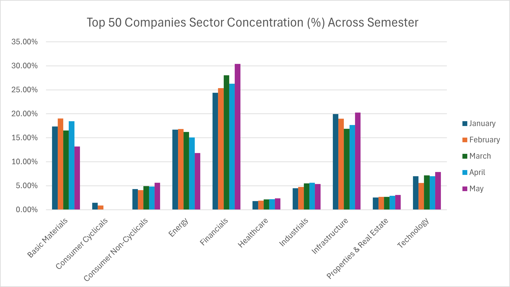
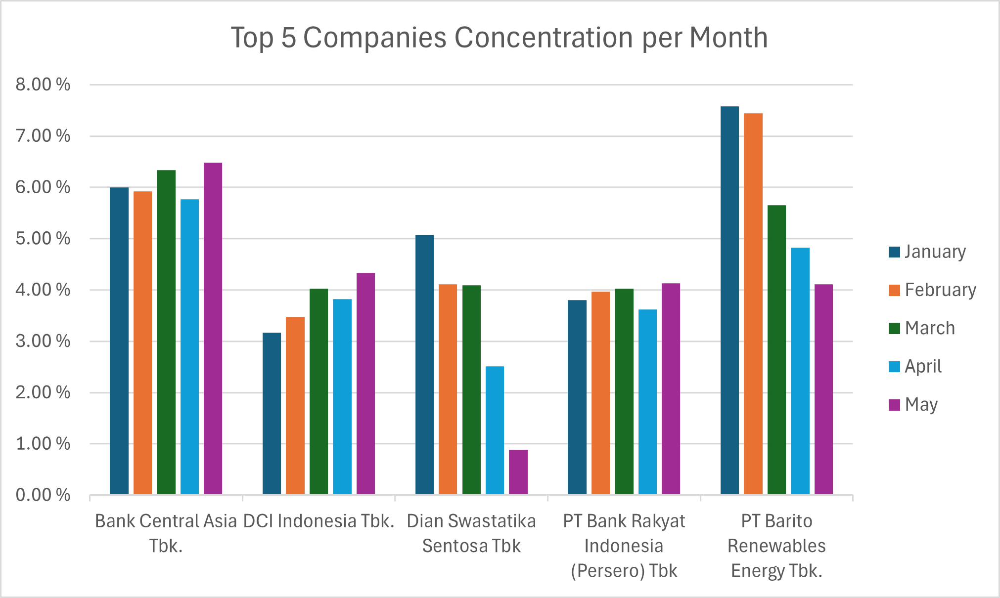
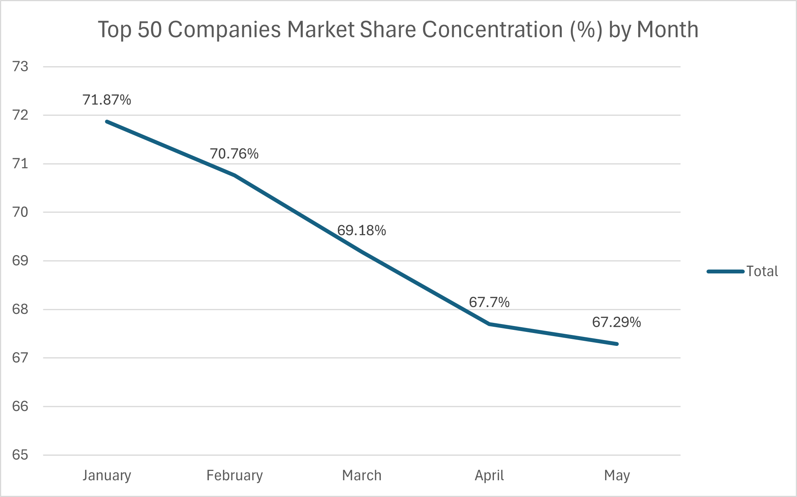

# IDX-Top50-First-Semester-Personal-Analysis-Ravindra
A project to analyze top 50 Companies indexed in IHSG in the first Semester of 2026 using Python and Excel

> ### ⚠️ Disclaimer
> This project was assisted by Gemini AI and this analysis is for **Informational Purposes Only**. I am not a financial advisor. Do your own research (DYOR) before making any investment decisions. [...]

## 📑 Table of Contents
- [Analysis](#analysis)
  - [Macro Sector Dynamics](#macro-sector-dynamics)
  - [The Micro Leaderboard Drift](#the-micro-leaderboard-drift)
  - [Systemic Decentralization Metric](#systemic-decentralization-metric)
- [Personal Take](#personal-take)
- [Technical Setup](#technical-setup)
- [Project Structure](#project-structure)

## Technical Setup

### Prerequisites
- **Python 3.13** or compatible version
- **Required Libraries:**
  - `pandas` - Data manipulation and analysis
  - `openpyxl` - Excel file handling
  - `pathlib` - File path operations
  - `csv` - CSV data processing

### Installation & Setup

1. **Clone the Repository**
   ```bash
   git clone https://github.com/FishyDeveloper/IDX-Top50-First-Semester-Personal-Analysis-Ravindra.git
   cd IDX-Top50-First-Semester-Personal-Analysis-Ravindra
   ```

2. **Install Dependencies**
   ```bash
   pip install pandas openpyxl
   ```

3. **Data Preparation**
   - Download market capitalization data from [IDX Official Statistical Reports](https://idx.co.id/en/market-data/statistical-reports/digital-statistic/monthly/biggest-market-capitalization-most-active-stocks/biggest-market-capitalization?filter=eyJ5ZWFyIjoiMjAyMyIsIm1vbnRoIjoiNSIsInF1YXJ0ZXIiOjAsInR5cGUiOiJtb250aGx5In0%3D)
   - Reference company sector data: [Wikipedia - Listed Companies on IDX](https://id.wikipedia.org/wiki/Daftar_perusahaan_yang_tercatat_di_Bursa_Efek_Indonesia) *(2024 data - may require additional research)*
   - Place raw data files in the `Raw Files/` directory

### Execution Workflow

Follow these steps **in sequential order**:

1. **Run Rename Script**
   ```bash
   python Python\ Files/rename_script.py
   ```
   Standardizes and renames raw data files for consistent processing.

2. **Extract Master Asset to CSV**
   ```bash
   python Python\ Files/master_asset_to_csv.py
   ```
   Converts master asset data into CSV format for analysis.

3. **Merge Monthly Lists**
   ```bash
   python Python\ Files/merged_list.py
   ```
   Consolidates all monthly data (January-June) into a single unified dataset.

4. **Generate Analysis & Visualizations**
   - Excel pivot tables and analysis files are generated in the `Processed/` folder
   - Final visualizations and charts are saved to the `Visuals/` folder

### IDE & Configuration
- Recommended: **PyCharm** (automatically manages Python path configuration)
- No external configuration files required; standard Python environment setup is sufficient

## Project Structure

```
IDX-Top50-First-Semester-Personal-Analysis-Ravindra/
├── Raw Files/              # Source data from IDX and Wikipedia
├── Python Files/           # Python scripts (rename, master asset, merge)
│   ├── rename_script.py
│   ├── master_asset_to_csv.py
│   └── merged_list.py
├── Processed/              # Excel files with analysis and pivot tables
├── Visuals/                # Generated charts, graphs, and pivot table exports
├── README.md
└── .gitignore

```

## Analysis

### Macro Sector Dynamics
*Dynamic market share distribution tracking sector dominance shifting month-by-month.*


The financial sector maintains the highest relative concentration within IHSG, exhibiting a strong upward trend throughout the semester. Initially, the financial sector has an approximately 24.3% [...]

A similar structural resilience is exhibited by the Technology sector. Despite maintaining a modest baseline footprint with 6.5% on average of the top 50 index weight, the sector consistently defe[...]

The lower-weight spectrum reveals a trajectory of steady structural accretion in both Healthcare and Real Estate. Healthcare successfully scaled its index footprint from 1.82% to 2.36% over the fi[...]

Conversely, the Energy and Basic Materials sectors experienced a pronounced structural contraction within the top 50 hierarchy across the first semester. Basic Materials compressed from a 17.34% c[...]


### The Micro Leaderboard Drift
*Tracking the top index titans as capital flows between speculative infrastructure and defensive banking.*


The micro layer reveals that $BREN (PT Barito Renewables Energy) held the dominant position early in the semester, maintaining a peak concentration of around 7.5% across January and February. This[...]
Another component experiencing a severe structural contraction is $DSSA (Dian Swastatika Sentosa Tbk). While $DSSA maintained an initial relative concentration of 5.08% in January before adjusting[...]
In stark contrast to the volatile contractions of $BREN and $DSSA, the banking heavyweights $BBCA (Bank Central Asia Tbk.) and $BBRI (Bank Rakyat Indonesia (Persero) Tbk.) exhibited highly resilie[...]
In contrast, $DCII maintained a slowly growing concentration throughout the semester. In January, they held a 3.17% weight, followed by a stable phase from February until April where they averaged[...]


### Systemic Decentralization Metric
*The steady downward velocity proving money is migrating out of the mega-caps into broader market tiers.*


The aggregate metric uncovers a steady dilution of concentration within the index, as the combined weight of the top 50 equities decelerated smoothly from 71.87% in January to 67.29% by the end of[...]

## Personal Take
The overwhelming dominance of the Financials sector presents a classic dual-edged sword for market participants. While it offers a highly attractive, resilient vehicle for long-term investing and [...]
